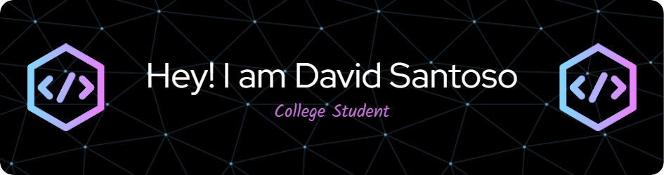

## Hi I'm David 👋

🔭 Currently study in university  
🌱 I’m currently learning Artificial Intelligence  
💻 Passionate about software development and creative technology
🚀 Exploring Web Development, Machine Learning, and IoT projects
🎯 Goal-oriented and always eager to learn something new

---

### Programming Language

     

---

### Frameworks

 

---

### Social Media

